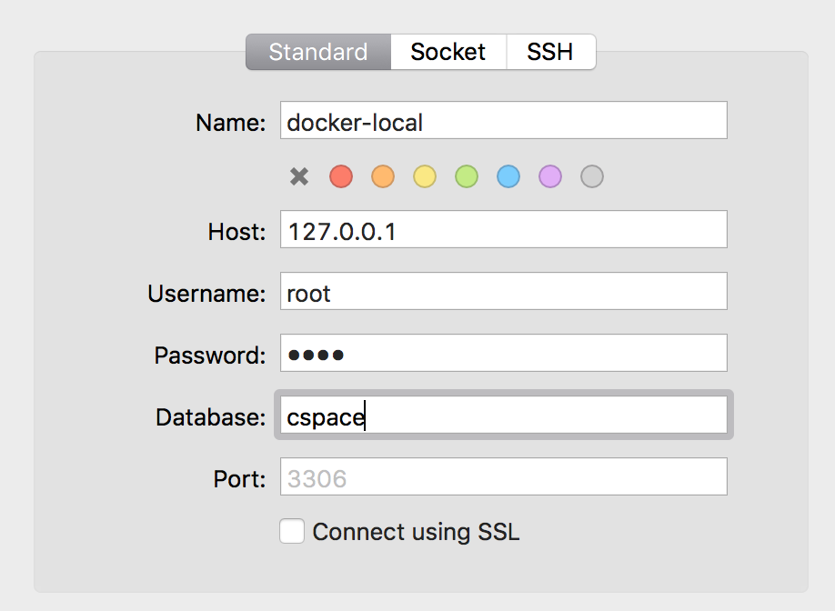

#Wordpress Docker Compose

Basic starter setup for Wordpress. Integrates: *Docker*, *mySQL*, *SQL*, *etc*

##Getting Started

* The first thing you need to do is install Docker on your local machine. If you’re using a [Mac](https://www.docker.com/docker-mac target="_blank") or [Windows](https://www.docker.com/docker-windows target="_blank"), Docker provides a great little installer to make that simple. Docker also provides distributions for all flavours of Linux.
* Install [Sequel Pro](https://www.sequelpro.com/ target="_blank")
* Clone the repo
* Using Terminal navigation to the cloned folder
* Run: `docker-compose up`
* Launch Sequel Pro - follow the setup below: 

* Select database - cspace
* Import database from bd folder